# UbuntuMate使用wireguard虚拟组网

## 前期装备

- 一个debian的发行版，这里使用的是Ubuntu Mate
- 5.6的内核
- 另外一台需要组网的设备，此处为Android版本的wireguard

涉及到的软件包
- wireguard-tools 用于管理wireguard的基础工具
- network-manager 网络管理服务，桌面版默认带此服务

安装对应软件

```bash
sudo apt install wireguard-tools network-manager
```

## 结构说明

真实网络IP：
- Ubuntu Mate IP : 192.168.1.1/24
- Android 手机IP : 192.168.1.2/24


虚拟局域网IP配置：
- Ubuntu Mate IP : 192.168.30.1/24
- Android 手机IP : 192.168.30.2/24


需要使用 `wireguard` 组网的每个设备作为一个节点，他们的地位都是平等的，不分服务端和客户端

只要有一节点往另一节点发起握手的请求，并且握手成功后，对方就能知道该节点。

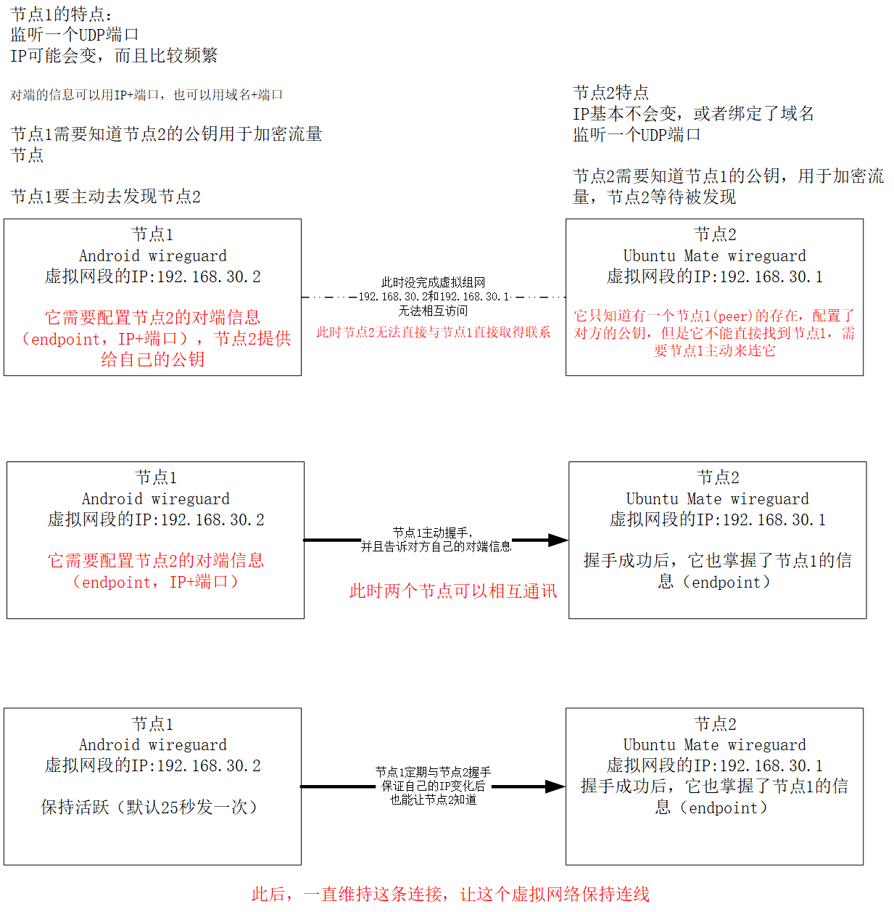


对于单个节点它涉及到的配置有
- 自己的私钥，给自己配置
- 自己的公钥，给其他节点
- UDP监听端口

对于节点的其他伙伴（peer）的配置
- 别人的公钥
- 允许的源地址（allow-ip），不符合的源IP将被过滤，不过滤可以直接配置成 **0.0.0.0/0**
- 对端（该节点实际网络的IP/域名+UDP端口），可选，如果不设置，则等待对方连自己
- 保持活跃的频率，可选，如果不设置，默认25秒


## 创建节点

生成一个密钥

```
x@x-mate:~$ wg genkey
8FhlONlPATUoC4a/VtcHmzAp7fWO4otiF4N8YmX3p0o=
```

`8FhlONlPATUoC4a/VtcHmzAp7fWO4otiF4N8YmX3p0o=` 

就是该节点的密钥信息


NetworkManager 有集中客户端，目前使用 `nmtui` 


```bash
sudo nmtui
```

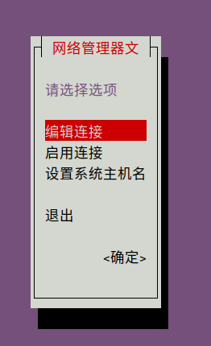

`编辑连接` 创建一个wireguard节点

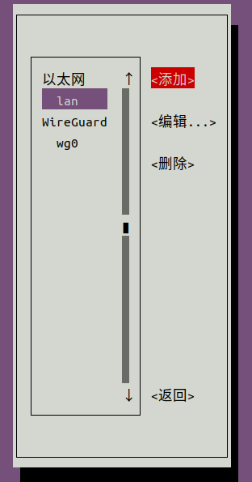

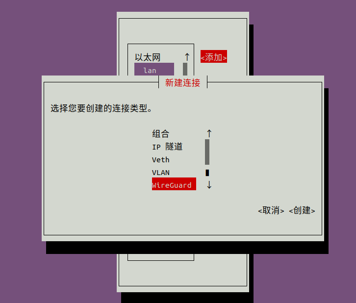

配置名称为： `wireguard-conn`

创建的虚拟接口名称： `wg-virtlan`

密钥为：`8FhlONlPATUoC4a/VtcHmzAp7fWO4otiF4N8YmX3p0o=`

UDP监听端口：`65003`

不给peer添加路由，他会根据 `allow-ip` 的IP段配置路由，如果设置成 `0.0.0.0/0`，会配置多一条默认网关，影响上网。

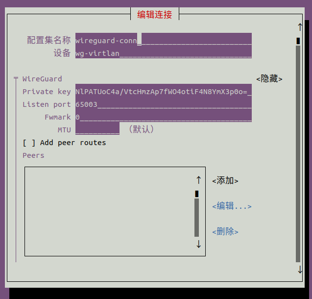

IPv4配置选择 **手动** ，选择右边 **显示** 按钮，展开配置列表

配置节点的接口 `wg-virtlan` IP地址： `192.168.30.1/24`


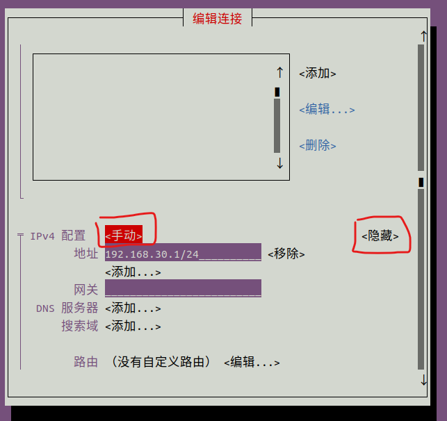

保存配置信息

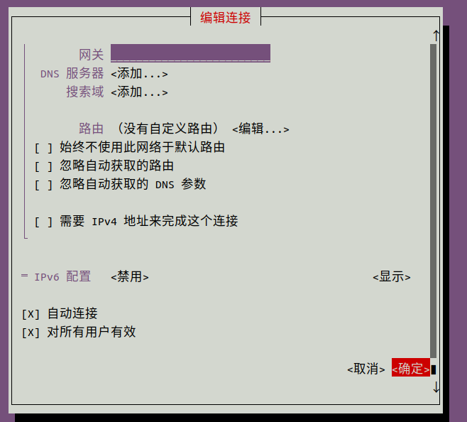

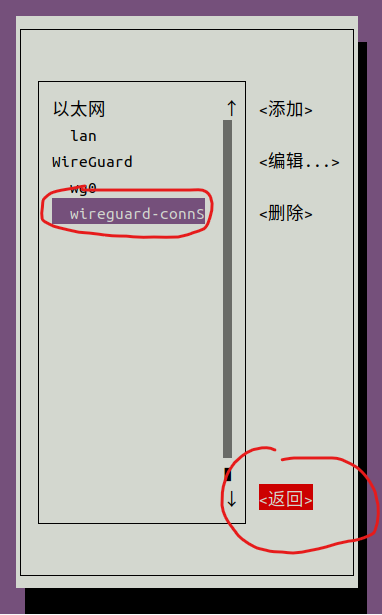

选择启用连接，以生效这个配置


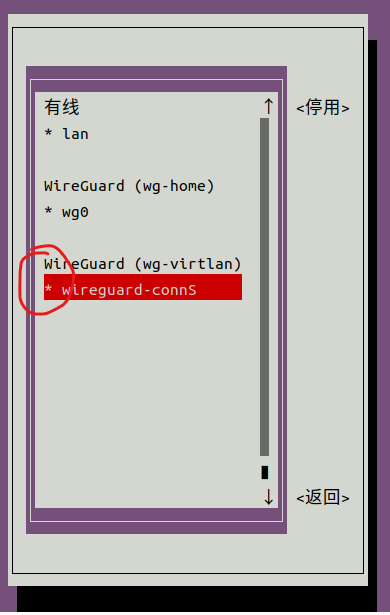

当这个配置前面带一个 `*` 说明该配置已生效，选中回车切换 `停用/启用`

推出nmtui

## 通过wg命令查看已经生效的wg配置

```bash
x@x-mate:~$ sudo wg show
interface: wg-virtlan
  public key: L67JN2jqFbtpKKmsC+iNdAP9oxeeQ4Fr+gEYp/r5Syc=
  private key: (hidden)
  listening port: 65003
```

可以看到，此时已经存在一个 wireguard 接口 `wg-virtlan` ，这个节点监听了，但是它没有任何peer，目前它是没有组网的


## Android Wireguard 配置节点

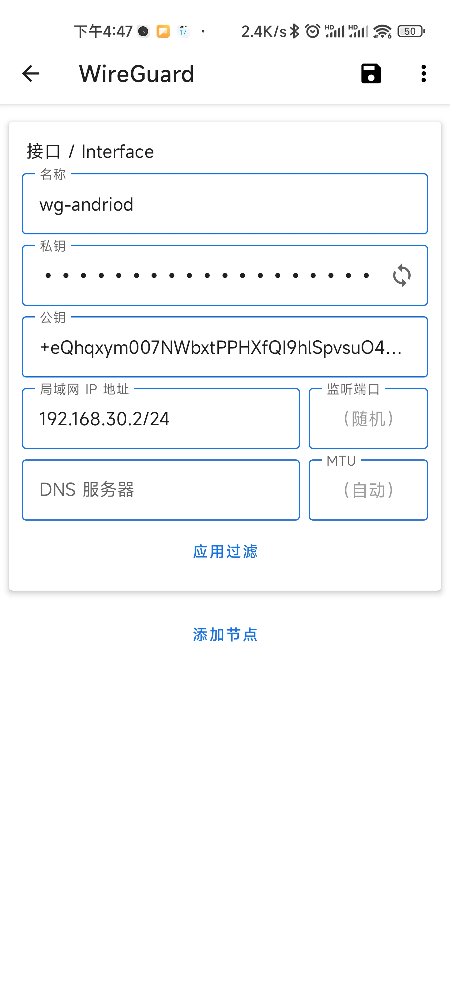

新建一个配置文件，wg-android

右边按钮生成一个私钥，公钥是可以长按复制的，复制下来给Ubuntu配置peer。

`+eQhqxym007NWbxtPPHXfQI9hlSpvsuO49aaCGmC3mo==`

配置虚拟网段的IP：`192.168.30.2/24`

右上方保存，完成节点的配置，一旦配置成功后，不要再刷新私钥了，否则Ubuntu那边的公钥也需要同步更换。

## 给Ubuntu 添加 Andoird Wireguard 节点

nmtui 编辑 `wireguard-conn` 配置


选择 Peers 下 `添加` 新增 Android Wireguard的节点进去

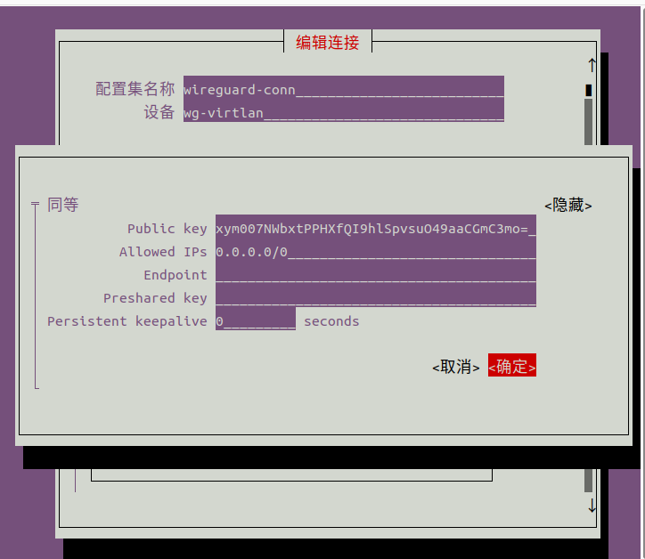

配置要点：
- Public key 为 对方的公钥（Android的）
- allowed IPs 设置成 `0.0.0.0/0`
- Preshared key 不设置
- Persistent keepalive 设置成 0


然后保存配置，重新生效配置，如果配置不生效，尝试停用后启用。

查看Peer是否新增成功

```bash
x@x-mate:~$ sudo wg show
interface: wg-virtlan
  public key: L67JN2jqFbtpKKmsC+iNdAP9oxeeQ4Fr+gEYp/r5Syc=
  private key: (hidden)
  listening port: 65003
  fwmark: 0xcac2

peer: +eQhqxym007NWbxtPPHXfQI9hlSpvsuO49aaCGmC3mo=
  allowed ips: 0.0.0.0/0
```

新增节点成功

## 给Android也添加Ubuntu作为Peer

复制wg show 看到的公钥 

```bash
x@x-mate:~$ sudo wg show
interface: wg-virtlan
  public key: L67JN2jqFbtpKKmsC+iNdAP9oxeeQ4Fr+gEYp/r5Syc=
  private key: (hidden)
  listening port: 65003
  fwmark: 0xcac2

peer: +eQhqxym007NWbxtPPHXfQI9hlSpvsuO49aaCGmC3mo=
  allowed ips: 0.0.0.0/0
```

`L67JN2jqFbtpKKmsC+iNdAP9oxeeQ4Fr+gEYp/r5Syc=` 复制，编辑Android Wireguard配置

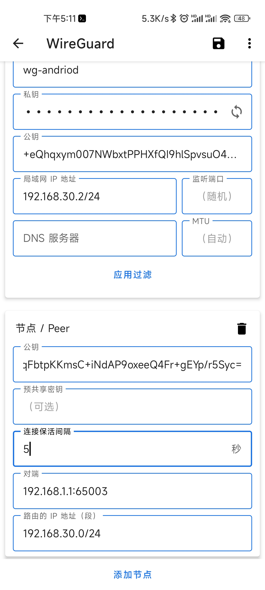

添加节点

公钥由Ubuntu提供：`L67JN2jqFbtpKKmsC+iNdAP9oxeeQ4Fr+gEYp/r5Syc=`

对端（endpoint）：为Ubuntu的实际IP地址+它UDP监听端口，这里是 `192.168.1.1`

连接保活间隔：5秒

路由的IP：此选项影响路由，如果想通过wireguard路由转发其他网段的流量，这里应该设置多条，默认是虚拟局域网段的 `192.168.30.0/24`


保存即可，完成配置。