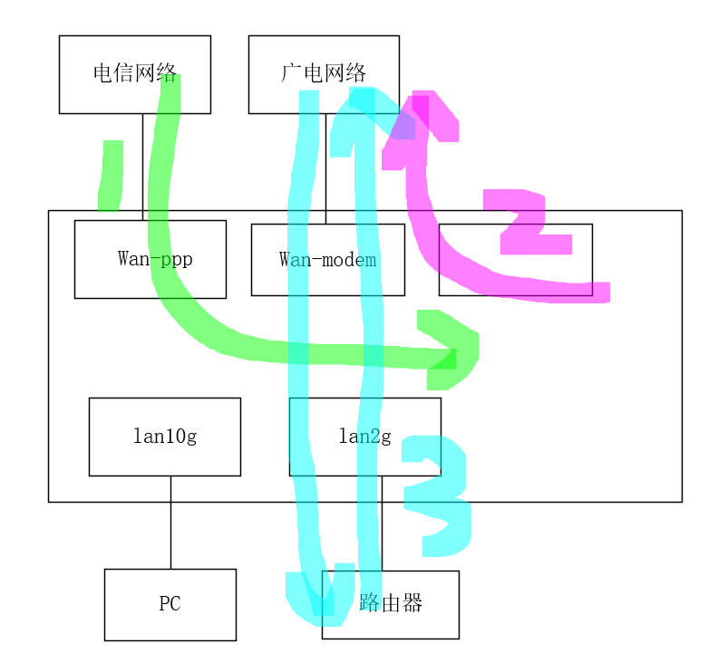
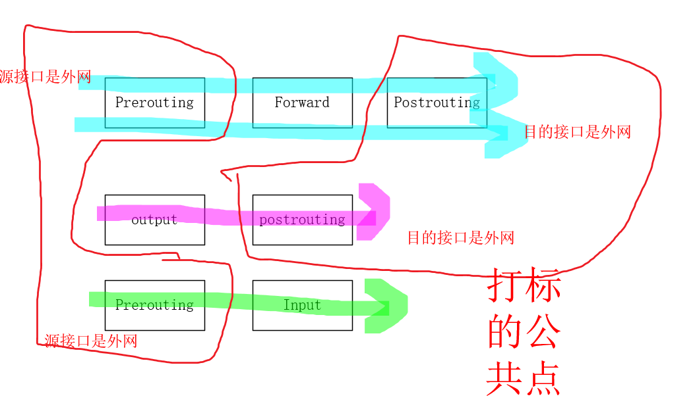

# 基于conntrack mark标记的源进源出标记方案

## 什么是源进源出



看上图，有两个运营商网络做了均衡负载，可能出现情况3，PC认为这是一个连接，服务端则认为，这是一个新的连接。

那么当一个连接建立后，希望它总是从一个线路出入。

先分析，与外网相关的第一个数据包，可能从4个方向发起的

- 外网发起，发送给路由器的
- 路由器发起，发送给外网的
- 路由器转发的，由子网发起、或者由外网发起到子网的

经过 **netfilter** 的路径是这样的


根据 **源接口** 和 **目的接口** 将他们分成两组规则



那么打 **ct mark** 有两组规则

- 在 **prerouting** 链， ct 状态为 *new* ，符合特定的输入接口（ *iif* ），打上ct mark
- 在 **postrouting** 链， ct 状态为 *new* ，符合特定的输入接口（ *oif* ），打上ct mark


当连接状态转换到 *established* ，这条连接的输入接口和输出接口应该固定下来，就好像单个上网wan一样。

所以在路由查找之前，需要对数据包进行标记，这个标记的来源是 **ct mark**


需要对符合条件的数据包进行 **meta mark** 标记

- 在 *prerouting* 链，输入接口（ *iif* ）为wan， ct 状态为 *established* ， 需要从ct mark中取标记出来打标数据包
- 在 *output* 链，输出接口（ *oif* ）为wan， ct 状态为 *established* ， 需要从ct mark中取标记出来打标数据包


# 策略路由规则的考虑

编排路由表应该遵循：

- main 表作为默认的路由表，所有与wan无关的路由可以被添加到这个表
- main 表不能包含默认路由
- 各个 wan 默认路由放在一个单独的表
- 均衡负载默认路由单独一个表 balance


# 配置测试设计

```
# 两个外网接口基础信息,以及lan网络接口信息
wan1: 192.168.1.10  网关 192.168.1.1 路由表
wan2: 192.168.2.10  网关 192.168.2.1 
lan: 192.168.10.1
```

## 路由表分配

```
# /etc/iproute2/rt_tables
250     balance
251     wan1
252     wan2


255     local
254     main
253     default
0       unspec
```
路由表的最多有256张(0-255)，其中254 255默认被系统使用。

wan1 的默认路由设置在编号为251的路由表，路由表别名为wan1

wan2 的默认路由设置在编号为252的路由表，路由表别名为wan2

balance 路由表用于放置均衡负载的默认路由，编号250


路由表最终是个数字，用rt_tables让它可读性增强


### 设置wan1路由表

```
ip route add default via 192.168.1.1 table wan1  dev wan1 
```

### 设置wan2路由表

```
ip route add default via 192.168.2.1 table wan2  dev wan2
```

### 设置默认的表main（编号254）

```
ip route add 192.168.10.0/24 table main dev lan
ip route add 192.168.1.0/24  table main dev wan1 
ip route add 192.168.2.0/24  table main dev wan2
```


### 设置balance路由表（编号250）

```
ip route add default table balance \
	nexthop via 192.168.1.1 dev wan1 weight 1 \
	nexthop via 192.168.2.1 dev wan2 weight 2 \
```

wan1和wan2的发送流量比例是1:2


## 路由策略

fwmark 分配
```
wan1   1
wan2   2
```

需要从wan1出去的连接打上编号为2的标记，3对应的是wan2


**ip rule** 命令可以设置路由的查找策略，每一条规则由3部分组成

- 规则的优先级
- 匹配条件
- 匹配成功后的动作(跳转到特定的规则重新匹配，查找路由表)


priority数值越小，优先级越高，规则越先被匹配

如果在对应的路由表中没有找到相关的路由，则继续遍历规则

如果没有满足规则匹配条件则继续下一条。


### 优先级分配

策略路由的逻辑


设置的原则

- main 表一定要在 fwmark 匹配前
- 均衡负载的路由一定要在fwmark匹配之后


```
ip rule add from all table main priority 100
ip rule add fwmark 1  table wan1 priority 101
ip rule add fwmark 1  table wan2 priority 101
ip rule add from all table balance priority 103
```


### nftables 配置

nftables 设置，wan1 和 wan2 是两个外网的接口

```
# /etc/nftables.conf
table inet mangle {

        chain prerouting-ct-package-mark {
                type filter hook prerouting priority mangle; policy accept;
                iifname "wan1" ct state new ct mark set 1 counter comment "wan1 ct标记"
                iifname "wan2" ct state new ct mark set 2 counter comment "wan2 ct标记"
                ct state established meta mark set ct mark  counter comment "应用ct标记到数据包"
        }

        chain output-package-mark {
                type filter hook output priority mangle; policy accept;
                ct state established meta mark set ct mark counter comment "应用ct标记到数据包"

        }

        chain postrouting-ct-mark {
                type filter hook postrouting priority mangle; policy accept;
                oifname "wan1" ct state new ct mark set 1 counter comment "wan1 ct标记"
                oifname "wan2" ct state new ct mark set 2 counter comment "wan2 ct标记"
        }
}
```


