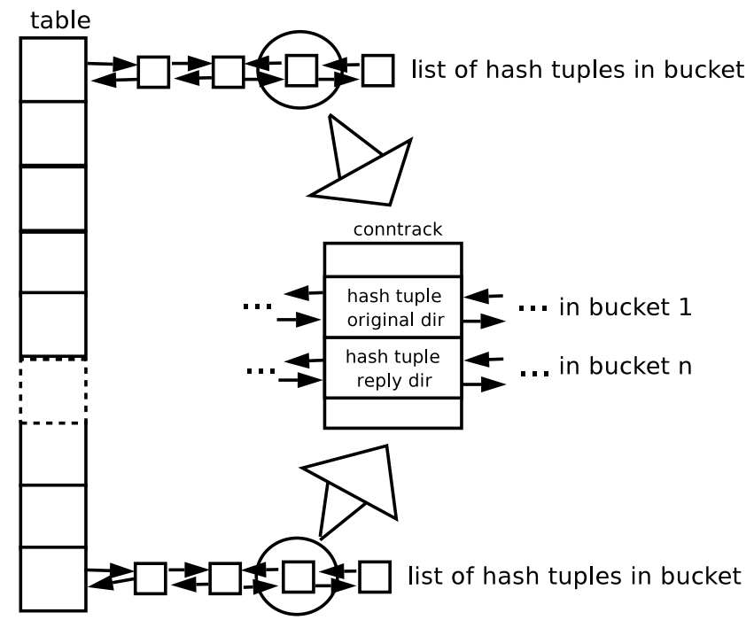

# Netfilter’s connection tracking system 

> Pablo Neira Ayuso拥有计算机科学硕士学位，曾为IT安全行业的几家公司工作，专注于开源解决方案。现在，他是塞维利亚大学的全职教师和研究员。*pneira@lsi.us.es*

## 基于  UNIQUELY 过滤策略

在包头信息是过时的。现在，有状态防火墙提供了高级机制，让系统管理员和安全专家定义更智能的策略。本文描述了Netfilter项目提供的连接跟踪系统的实现细节，并介绍了理解它所需的背景知识。比如理解Netfilter框架。本文将是对理解子系统的完美补充，子系统支持在任何最新的Linux内核中使用有状态防火墙

## Netfilter框架

Netfilter项目是由Paul“Rusty”Russell在2.3年期间创建的。x系列开发。当时，现有的Linux防火墙工具有严重的缺陷，需要完全重写。Rusty决定从零开始，创建Netfilter框架，它包含一组Linux网络协议栈上的钩子。使用钩子（hook），您可以注册在不同阶段执行某种网络包处理的内核模块。

Iptables是Linux上流行的防火墙工具，它经常与Netfilter框架本身混淆。这是因为iptables链和钩子（hook）具有相同的名称。但是iptables只是Netfilter框架之上的一块砖头。

幸运的是，Rusty花了相当多的时间编写文档[1]，这些文档对于任何愿意理解框架的人来说都很方便，尽管在某些时候您肯定会觉得需要亲自动手，查看代码以进一步了解框架。

## hook和回调函数（callback function）
Netfilter在Linux网络堆栈中插入5个钩子(图1)，在不同的阶段执行数据包处理。这些是:

- PREROUTING：所有的数据包，没有例外，都到达这个钩子，在路由决定之前和之后完成IP报头完整性检查。港口

    地址转换(NAPT)和重定向(DNAT)都在这个钩子中实现。

- LOCAL INPUT：所有到本地机器的数据包都到达这个钩子。这是本地机器通信传入路径中的最后一个钩子。

- FORWARD：不去本地机器的数据包(例如，数据包通过防火墙)到达这个钩子。

- LOCAL OUTPUT：这是发送包路径中的第一个钩子。离开本地机器的数据包总是命中这个钩子。

- POSTROUTING：这个钩子在路由决定之后实现。源网络地址转换(SNAT)被注册到这个钩子。所有离开本地机器的数据包都到达这个钩子

因此，我们可以根据目的地建立三种交通流（traffic flows）模型：

- 通过防火墙的流量，换句话说，流量没有到达本地机器。流量经过这个路径： **PREROUTING ** **FORWARD ** **POSTROUTING** 。

- 进入防火墙的流量，例如本地机器的流量。流量流经这个路径： **PREROUTING**  **INPUT** 。
- 从防火墙流出的流量： **OUTPUT**  **POSTROUTING**

可以向给定的钩子注册回调函数。回调函数的原型定义在 **netfilter.h** 中的 *nf_hook_ops* 结构中。这个结构包含了关于要注册回调的钩子的信息，以及优先级。因为你可以向一个给定的钩子注册多个回调，所以优先级指示哪个回调先发出。寄存器操作是通过函数 *nf_register_hook(...)* 完成的。

回调函数可以返回几个不同的值，框架将以以下方式解释这些值：

- ACCEPT：让数据包继续在堆栈中移动。

- DROP：静默地丢弃数据包。

- QUEUE：通过 *nf_queue* 工具将数据包传递给用户空间。因此，用户空间程序将为我们处理数据包。

- STOLEN：静默地保存数据包，直到发生一些事情，这样它暂时不会继续通过堆栈。这通常用于收集整理后的IP包。

- REPEAT：强制数据包重新进入钩子。

简而言之，该框架提供了一种方法来注册一个回调函数（callback function），该函数在前面详细介绍的任何阶段执行某种类型的包处理。发布的返回值将由应用基于此判决的策略的框架获取。

如果您认为这里提供的信息不够充分，需要更多关于Linux网络堆栈的背景知识，那么请参考可用的关于通过Linux网络堆栈的包传输的文档[2]。

## 连接跟踪系统和状态检查

过去只根据报文头信息(如源IP、目的IP、源端口、目的端口)进行包过滤的时代已经结束。多年来，这种方法已被证明对探测和拒绝服务攻击保护不足。

幸运的是，现在的系统管理员几乎没有理由不在他们的防火墙中执行状态过滤。有一些开源实现可以在生产环境中使用。在linux下，这个特性是在Netfilter项目诞生时添加的。连接跟踪是建立在Netfilter框架之上的另一块砖。

基本上，连接跟踪系统（connection tracking system）在内存结构中，存储有关连接状态的信息，包含源和目的IP地址、端口号对、协议类型（protocol type）、状态（state）和超时（timeout）。

此外，对于遵循传统静态过滤方法的防火墙来说，有些应用程序协议(如FTP、TFTP、IRC和PPTP)有些方面是难以跟踪的。为此，连接跟踪系统定义了跟踪机制，如下所述。

连接跟踪系统本身不过滤数据包，缺省行为是让数据包总是继续通过网络堆栈，尽管有一些非常特定的例外，数据包可以被丢弃(例如，在内存耗尽的情况下)。因此，请记住，连接跟踪系统只是跟踪数据包，但它不过滤。

### STATES

为连接定义的可能状态如下：

-  **NEW** ：连接正在启动。达到这个状态，如果包是有合法的，也就是说，如果它属于有效序列的初始化(如TCP连接,SYN数据包接收)，如果防火墙只在一个方向上看到流量(例如，防火墙还没有看到任何回复包)。
-  **ESTABLISHED** ：已经建立链接。换句话说，当防火墙看到双向通信时，就会达到这种状态
-  **RELATED** ：这是期望的链接。下面将进一步描述这种状态，在 “Helpers and Expectations.” 章节有描述。 
-  **INVALID** ：这是一种特殊状态，用于不遵循连接预期行为的数据包。系统管理员可以选择在 **iptables** 中定义规则来记录和删除这种包。如前所述，连接跟踪并不过滤数据包，而是提供一种方法来过滤它们。

正如您肯定已经注意到的，通过遵循上述方法，即使是无状态协议(如UDP)也是有状态的。当然，上述这些状态与TCP状态没有任何关系。

### THE BIG PICTURE （整体情况）

本文主要关注第三层独立的连接跟踪系统实现 *nf_conntrack* ，它基于依赖 IPv4 的 *ip_conn_track* ，该系统从Linux内核2.6.15开始就可用了。对 IPv4 和 IPv6 特定方面的支持分别在 *nf_conntrack_ipv4* 和 *nf_conntrack_ipv6* 模块中实现。

四层协议的支持也在单独的模块中实现。目前，它内置了对 **TCP** 、**UDP** 、**ICMP** 和可选的 **SCTP** 的支持。这些协议处理程序跟踪给定的第4层协议的具体方面，以确保连接正确演变，没有任何坏事发生。

模块 *nf_conntrack_ipv4* 在几个钩子中注册了四个回调函数(图1)。这些回调位于 *nf_conntrack_core.c* 文件中，并以三层协议簇作为参数，因此它们与 **IPv6 ** 基本上是相同的 。回调可以分为三个系列：连接跟踪创建和查找、碎片整理包和辅助功能（helpers）。模块 *nf_conntrack_ipv6* 在本文档中将不再进一步描述，因为它类似于 **IPv4** 变体。

### IMPLEMENTATION ISSUES （现实中的问题）

**BASIC STRUCTURE （基本结构）**

连接跟踪系统（connection tracking system）是一个可选的模块化可加载子系统，尽管NAT子系统总是需要它。 它是用哈希表(图2)实现的，以执行有效的查找。每个桶（bucket）都有一个双链的散列元组列表。每个连接都有两个散列元组：一个用于原始（original）方向(即来自启动连接点的数据包)，一个用于应答（reply）方向(即去往启动连接点的应答数据包)。

元组表示连接的相关信息，源IP和目的IP，以及四层协议信息。这样的元组嵌入到散列元组中。这两个结构都在 *nf_conntrack_tuple.h* 中定义。

这两个散列元组嵌入到结构 *nf_conn* 中，从现在开始称为 **conntrack** ，它是存储给定连接状态的结构。因此，一个 **conntrack** 是两个散列元组的容器，每个散列元组是一个元组的容器。这就产生了三层嵌入结构。

哈希函数用于计算表示连接的哈希元组应该处于的位置。该计算以相关的三层和四层协议信息作为输入参数。目前，使用的函数是Jenkins的哈希[3]。

如果某个恶意用户对给定的哈希链进行哈希炸弹攻击，那么哈希计算就会增加一个随机种子，以避免潜在的性能下降，因为这可能导致一个非常长的哈希元组链。然而，连接表的最大连接数是有限的;如果它填满了，被逐出的 *conntrack* 将是哈希链中最近最少使用的。连接表的大小可以在模块加载时进行调整，或者在内核引导时进行调整。

### THE CONNTRACK CREATION AND LOOKUP PROCESS （连接跟踪的创建和查找过程）

回调 *nf_conntrack_in* 在 **PREROUTING** 钩子中注册。在这个阶段会进行一些完整性检查，以确保数据包是正确的。然后，在连接跟踪查找过程中进行检查。子系统试图查找与接收到的数据包匹配的连接跟踪。如果没有发现 **conntrack** ，它将被创建。该机制在 *resolve_normal_ct* 函数中实现。

如果数据包属于一个新的连接，那么刚刚创建的连接跟踪将取消确认标志的设置。如果 **conntrack** 已经在散列表中，则设置 *confirmed* 标志。这意味着此时不会插入新的 **conntrack** 。一旦数据包成功离开框架，就会发生这样的插入(即，当它到达最后一个钩子而没有被放下时)。数据包和连接链路之间的关联是通过指针建立的。如果指针为空，则该数据包属于一个无效连接。Iptables还允许我们取消对某些连接的跟踪。为此，使用了一个虚拟 **conntrack**。

总之，*nf_conntrack_confirm* 回调被注册在**LOCAL INPUT** 和 **POSTROUTING** 钩子。正如您已经注意到的，这两个钩子分别是本地和转发流量的出口路径中的最后一个钩子。确认过程此时发生：将 **conntrack** 插入到哈希表中，设置 *confirmed* 标志，并激活相关的计时器。

### DEFRAGMENTED PACKET HANDLING （整理包处理）

这项工作由回调 *ipv4_conntrack_defrag* 完成，它收集整理后的数据包。一旦成功接收到这些片段，它们将继续在堆栈中移动。

在2.4内核分支中，整理后的数据包被线性化，也就是说，它们被复制到连续内存中。然而，在2.6内核分支中引入了一个优化，以减少这种额外的处理成本的影响：片段不再复制到线性空间；相反，它们会被收集起来并放到一个列表中。因此所有的处理都必须是片段感知的。

例如，如果我们需要一些信息存储在TCP包的报头中，我们必须首先检查报头是否碎片；如果是，则只将所需的信息复制到堆栈中。这实际上不是问题，因为有一些易于使用的函数，比如 *skb_header_pointer*，它们是片段感知的，可以线性化数据包被整理碎片时所需的部分数据。否则，头检查不会招致任何处理惩罚。

### HELPERS AND EXPECTATIONS （辅助功能与期望）

一些应用层协议有一些难以跟踪的方面。例如，FTP (File Transfer Protocol)被动模式（passive）使用端口控制操作从服务器请求一些数据，但它使用1024到65535之间的TCP端口来接收请求的数据，而不是使用传统的TCP端口20。这意味着这两个独立的连接本质上是相关的。因此，防火墙需要额外的信息来成功过滤这类协议。

连接跟踪系统定义了一种称为helper的机制，该机制允许系统识别一个连接是否与现有连接相关。为此，它定义了期望（ *expectation* ）的概念。*expectation* 是一段时间内预期会发生的联系。它在 *nf_conntrack_core.h* 文件中定义为 *nf_conntrack_expect* 结构。

helper 搜索包中的一组模式，这些模式包含难以跟踪的方面。在FTP的情况下，帮助程序查找响应请求而发送的PORT模式，以开始一个被动模式连接(即PASV方法)。如果找到该模式，则创建一个期望，并将其插入到期望的全局列表中(图3)。因此，helper定义了一个预期可能连接的配置（profile）。

*expectation* 是有限的。如果创建了连接跟踪，连接跟踪系统将搜索符合 *expectation* 的连接。如果找不到匹配的，它将为这个连接寻找一个 helper。

当系统找到匹配的 *expectation* 时，新创建的 **conntrack** 与 产生这种 *expectation* 的主 **conntrack** 关联。

