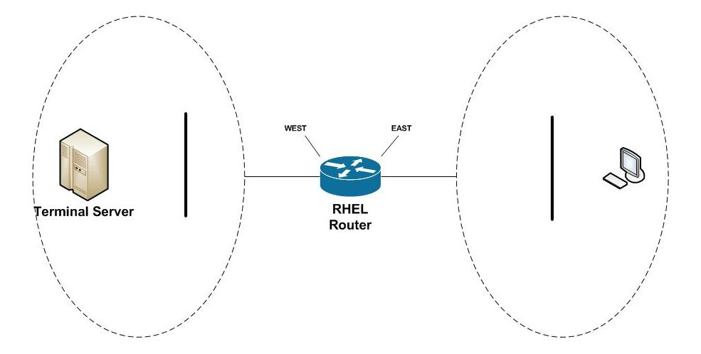

# Traffic shaping with a RHEL Router

[原文链接](http://carroll.net/blog/traffic-shaping-with-red-hat/)

流量整形（shaping）是将某些流量优先于其他流量的能力。网络是有限制的，当对网络的需求超过这些限制时，整形（shaping）使您能够选择什么流量最重要。通过整形，您可以选择延迟或丢弃（drop）较低优先级的流量，以确保更重要的流量畅通无阻。

虽然很容易理解整形（shaping）的需求，甚至它是如何工作的，但它的配置非常棘手。这项技术要求网络工程师理解排队规则（queuing disciplines）及它们如何影响网络。在因特网上下文中，它变得更加复杂，多个设备使用各自的队列系统移动数据包。

我们将简化复杂性，并研究适合大多数网络的特定流量整形配置。我们将对代码进行分解，并提供足够的解释，以确保您可以轻松地管理和修改它，以满足您的需要。

本文将开发并描述一个脚本，该脚本可以使Linux路由器在两个网络之间形成流量。它是为Red Hat Enterprise Linux (RHEL) 7.6版开发的，但它与任何现代Linux兼容。我们将假设以下两个网络配置。





WEST 和 EAST 是我们红帽路由器中连接两个网络的以太网设备的名称。东网的用户接入西网的终端服务器，同时接入其他网络服务。我们将了解如何将终端服务器流量(TCP端口3389)优先于所有其他流量。

# 如何在红帽中进行流量整形（ traffic shape ）


红帽中的流量整形是通过 **tc(8)** 命令控制的，该命令是 **iproute2** 项目的一部分。 **tc(8)**  使工程师能够执行广泛的流量控制操作，其中整形是其最常用的用途。

**qdisc** 是排队规则，它们定义了Linux系统的流量控制接口。它是数据包进入流量控制系统，然后离开到网络设备的地方。有很多种 **qdisc** 供你选择，但我们将重点关注两个最重要的， **tc-htb(8)**  和  **tc-sfq(8)**  ，稍后我们将对此解释。

**class** 是整形（ shaping ）发生的地方。 **class** 具有延迟（delay）、丢弃（drop）甚至重新排序（re-order）数据包的能力，这是排队系统的核心。它们引入了一个层次结构，由父类（parent classes）流向子类（child classes）。正是这种结构赋予了工程师定义队列并将它们链接在一起的能力和灵活性。

**filter** （过滤器）是您将包定向到 **class** 的方式。 **qdisc** 将定义紧随其后的默认路径，除非 **filter** 覆盖该路径。通过覆盖路径，工程师可以将数据包定向到一个 **class**，该 **class** 可以整形流量。 **filter**  提供了一个灵活的模式匹配系统来识别感兴趣的数据包，然后对它们进行分类。

## 警告

在处理流量整形时，需要注意两个重要的注意事项。首先，你只能整形出站(例如出口)流量。为了解决这一限制并确保我们的优先级适用于所有网络流量，我们创建了两个队列，一个在我们的WEST网络接口上，一个在我们的EAST网络接口上。

第二个警告是当路由器连接到不同带宽的网络时，我们如何管理速度。例如，我们假设路由器的WEST网络接口是一个 20 Mbps(兆比特) 的因特网连接，它的EAST网络接口是一个100 Mbps 的 LAN 网络。我们必须将流量限制在最慢的链路上，否则更快的网络可能会压倒较慢的网络，而我们的流量整形将没有任何作用。为了确保我们的整形是强制的，我们将把 WEST 和 EAST 的速度限制在 20 Mbps。

# 代码实现

下面是创建流量整形策略的 bash 脚本。

```bash
#!/bin/bash

configure() {
    local device=$1
    local maxrate=$2
    local limited=$3

    # Delete qdiscs, classes and filters
    tc qdisc del dev $device root 2> /dev/null

    # Root htb qdisc -- direct pkts to class 1:10 unless otherwise classified
    tc qdisc add dev $device root handle 1: htb default 10
    
    # Class 1:1 top of bandwith sharing tree
    # Class 1:10 -- rate-limited low priority queue
    # Class 1:20 -- maximum rate high priority queue
    tc class add dev $device parent 1: classid 1:1 htb rate $maxrate burst 20k
    tc class add dev $device parent 1:1 classid 1:10 htb \
        rate $limited ceil $maxrate burst 20k
    tc class add dev $device parent 1:1 classid 1:20 htb \
        rate $maxrate ceil $maxrate burst 20k

    # SFQ ensures equitable sharing between sessions
    tc qdisc add dev $device parent 1:10 handle 10: sfq perturb 10
    tc qdisc add dev $device parent 1:20 handle 20: sfq perturb 10

    # Classify ICMP into high priority queue
    tc filter add dev $device parent 1:0 protocol ip prio 1 u32 \
        match ip protocol 1 0xff flowid 1:20

    # Classify TCP-ACK into high priority queue
    tc filter add dev $device parent 1: protocol ip prio 1 u32 \
        match ip protocol 6 0xff \
        match u8 0x05 0x0f at 0 \
        match u16 0x0000 0xffc0 at 2 \
        match u8 0x10 0xff at 33 \
        flowid 1:20
}

main() {
    # Enable rate reporting in the htb scheduler
    echo 1 > /sys/module/sch_htb/parameters/htb_rate_est

    configure WEST 20mbit 5mbit
    configure EAST 20mbit 5mbit

    # Classify terminal server traffic outbound to WEST
    tc filter add dev WEST protocol ip parent 1: prio 2 u32 \
        match ip dport 3389 0xffff flowid 1:20

    # Classify terminal server traffic outbound to EAST
    tc filter add dev EAST protocol ip parent 1: prio 2 u32 \
        match ip sport 3389 0xffff flowid 1:20
}

main "$@"
```


# 解读

3-39行定义了 *configure()* 函数。这是我们为特定以太网设备构建出口队列的地方。该函数接受三个参数：网络接口设备名（ *$device* ），希望允许设备输出的最大速度（ *$maxrate* ），以及低优先级流量所需的较低速度（ *$limited* ）。在深入细节之前，先谈谈速度以及打算如何使用它们。

我们的流量整形系统是建立在一个称为“层次令牌桶”（Heirarchical Token Bucke，  **HTB**  ）的排队系统之上的。这是一种聪明的技术，它能让我们建立一个优先级金字塔。我们使用这个金字塔系统来定义两个队列：一个高优先级队列和一个低优先级队列。我们将把我们的终端服务器通信流量放到高优先级队列中，其他的东西放到低优先级队列中。

**HTB** 系统的特别之处在于，层次结构的每一层都允许带宽“借用”未使用的容量。这个想法是，如果高优先级队列没有使用它的所有分配，低优先级队列可以拥有它。你可以在 **tc-htb(8)** 上阅读更多关于 **HTB** 的内容。

```bash
# 片段1
# Root htb qdisc -- direct pkts to class 1:10 unless otherwise classified 
tc qdisc add dev $device root handle 1: htb default 10
```

片段1的第2行为每个以太网设备创建根队列（root），顾名思义，它是队列层次结构的顶层。它是内核添加数据包和设备删除数据包的地方。要记住的是，根（root）是包离开队列的地方。它们不会从等级的最底层“下坠”。正是这种上下波动使得“带宽借用”得以发生。

片段1的第2行还建立了一个重要的默认值。后缀 `default 10`将报文流配置为队列 ID 为 `1:10` 。除非 **filter** 干预，否则这是默认路径，即流量进入低优先级队列。

```bash
# 片段2

# Class 1:1 是共享树的顶层bandwith
# Class 1:10 -- 限制速率的低优先级队列
# Class 1:20 -- 最高速率高优先级队列
tc class add dev $device parent 1: classid 1:1 htb rate $maxrate burst 20k

tc class add dev $device parent 1:1 classid 1:10 htb rate $limited ceil $maxrate burst 20k
    
tc class add dev $device parent 1:1 classid 1:20 htb rate $maxrate ceil $maxrate burst 20k

```

片段2第6行，直接在 root 下创建了一个ID为 `1:1` 的的 **class** 。这定义了它（ *$device* ）下面所有子队列可用的最大带宽（ *$maxrate* ）。

片段2第8行定义了 ID 为 `1:10` 的低优先级队列。*cell* 参数的使用定义了它可以从父类（ *parent* ）借多少带宽（ *$maxrate* ）。我们将它设置为尽可能多地借用父节点可用的空闲带宽。

片段2第11行定义了id为 `1:20` 的高优先级队列。这个队列具有与它的父队列相同的速率，因此被分配了可用的全部速率（ *$maxrate* ）。

如果低优先级和高优先级队列都在争夺带宽，就会产生一个有趣的行为。排队系统根据速度分配的比例来分配容量。因为我们计划为高优先级队列分配 20mbps，为低优先级队列分配 5mbps，所以分配将是4比1。即每有1个报文进入低优先级队列，就有4个报文进入高优先级队列。

```bash
# 片段3
# SFQ ensures equitable sharing between sessions
tc qdisc add dev $device parent 1:10 handle 10: sfq perturb 10
tc qdisc add dev $device parent 1:20 handle 20: sfq perturb 10
```

片段3的第3和4行定义了层次结构底部的两个 **SFQ** 队列。 **SFQ** 不做任何整形，而是使用轮循调度系统，以确保每个“流”都有公平的机会发送数据包。在这种情况下，流对应于TCP/IP连接，  **SFQ**  确保一个连接不能独占带宽。你可以在 **tc-sfq(8)** 上阅读更多关于 **SFQ**  的信息。

```bash
# 片段4
# Classify ICMP into high priority queue
tc filter add dev $device parent 1:0 protocol ip prio 1 u32 \
    match ip protocol 1 0xff flowid 1:20
```

片段4的第3行介绍了我们的第一个过滤器（filter）。这个filter（过滤器）查找ICMP流量(例如ping包)并将其定向到高优先级队列。这确保了即使在网络使用频繁的时期，工程师仍然能够使用ping进行诊断。

```bash
# 片段5
# Classify TCP-ACK into high priority queue
tc filter add dev $device parent 1: protocol ip prio 1 u32 \
    match ip protocol 6 0xff \
    match u8 0x05 0x0f at 0 \
    match u16 0x0000 0xffc0 at 2 \
    match u8 0x10 0xff at 33 \
    flowid 1:20
```

片段5第2行是另一个过滤器（filter）。它将 **TCP-ACK** 报文引导到高优先级队列中。这样做可以确保及时交付这些重要的通信确认，即使网络正在经历大量使用。如果 **ACK** 延迟时间过长，发送方可能认为已被丢弃，并重新发送原始序列，从而进一步增加网络负载。

回到最初的脚本，第40到54行定义了main()函数。这是脚本的起点，并导致队列的配置。

```bash
# 片段6
# Enable rate reporting in the htb scheduler
echo 1 > /sys/module/sch_htb/parameters/htb_rate_est
```

片段6第3行启用队列的速率报告。这是一个有用的特性，允许工程师监视流量整形系统性能。稍后我们将提供一些示例。

```bash
# 片段7
configure WEST 20mbit 5mbit
configure EAST 20mbit 5mbit
```

片段7第2和3行通过调用前面描述的configure()函数来配置我们的两个网络接口。

```bash
# 片段8
# Classify terminal server traffic outbound to WEST
tc filter add dev WEST protocol ip parent 1: prio 2 u32 \
    match ip dport 3389 0xffff flowid 1:20

# Classify terminal server traffic outbound to EAST
tc filter add dev EAST protocol ip parent 1: prio 2 u32 \
    match ip sport 3389 0xffff flowid 1:20
```

片段8第3行定义了WEST以太网接口的出口过滤器（filter）。它将目的端口为3389的数据包定向到高优先级队列。

片段8第7行义EAST以太网接口的出口过滤器。它类似于WEST出口，但它将源端口为3389的报文直接进入高优先级队列。

# 监控流量整形

监控流量整形系统最简单的方法是使用 **tc(8)** 命令。下面两个命令将分别报告 WEST 接口和 EAST 接口的统计信息。

```bash
# tc -s class ls dev WEST
# tc -s class ls dev EAST
```

每一个的输出看起来都很相似。下面是一个使用流量控制脚本从实时系统中获取的示例。突出显示的部分确定了要查看的最重要的元素。

```bash
class htb 1:10 parent 1:1 leaf 10: prio 0 rate 5Mbit ceil 20Mbit burst 20Kb cburst 1600b
 Sent 18575133765 bytes 28631268 pkt (dropped 111212, overlimits 0 requeues 0)
 rate 273688bit 122pps backlog 0b 0p requeues 0
 lended: 21760240 borrowed: 6871028 giants: 0
 tokens: 509550 ctokens: 9387

class htb 1:1 root rate 20Mbit ceil 20Mbit burst 20Kb cburst 1600b
 Sent 34359166476 bytes 155788322 pkt (dropped 0, overlimits 0 requeues 0)
 rate 905232bit 1110pps backlog 0b 0p requeues 0
 lended: 6871028 borrowed: 0 giants: 0
 tokens: 127243 ctokens: 9243

class htb 1:20 parent 1:1 leaf 20: prio 0 rate 20Mbit ceil 20Mbit burst 20Kb cburst 1600b
 Sent 15784032711 bytes 127157054 pkt (dropped 610, overlimits 0 requeues 0)
 rate 631544bit 987pps backlog 0b 0p requeues 0
 lended: 127157054 borrowed: 0 giants: 0
 tokens: 127243 ctokens: 9243
```

> 重点部分是：dropped数据包的数量，rate质量。

输出分为三个部分，分别对应我们的三个 **class** 。每个部分都标识了 **class** 、它的配置以及自创建以来收集的统计信息。

**class** 层次结构的顶层是 **class**  `1:1` 。通过观察这些统计信息，可以大致了解流经系统的数据包总数。最有用的统计数据是速率，即数据包每秒流出的比特数和 pps ，pps即每秒封包数量（packets per second）。

观察各个队列也有助于了解网络是如何被使用的。您可以刷新报告并比较连续的调用，以查看队列是如何分配数据包的。

实时观察队列的一种有用方法是将其中一个命令与 **watch(1)** 实用程序结合使用。例如：

```bash
# watch tc -s ls dev WEST
```

您应该注意过量被丢弃的数据包（dropped）或单个队列维持其最大分配的时间。这两种情况都可以表明您的网络超过了它的容量。您可以使用它来指导对队列配置的修改或调查原因。也许这是流氓流量或网络滥用的指示。如果您的网络丢弃了过多的数据包，或者在很长一段时间内保持了最大容量，您将需要采取措施，这些统计数据将提供您需要知道的信息。


# 我的总结

不仅通过定义filter，将流量划分到某个 **class** ，还有一种方法，通过 **nftables** 中规则修改数据包修改tc的classid，它相关的规则语法在：

```
meta priority set [tc class id]
```

这里的 `tc class id`  就是对应的 class的句柄。例如 `1:20` 。

但是，我们需要根据流量流经的hook，确定我们到底在哪个位置，对流量的优先级进行调整。

```
对于发出的流量：OUTPUT => POSTROUTING => 网络接口的队列

对于转发的流量：PREROUTING => [过路由判别为非本机流量，转发] => FORWARD => POSTROUTING => 网络接口队列
```

那么，针对本机的流量，我们应该在 OUTPUT 处进行优先级调整，例如，我们要调整wan口发送的 ssh 流量优先级 `1:20`

```bash
# 创建一个ip filter 表
sudo nft 'add table ip filter'
# 创建一个基链，关联到output 钩子，output hook的基链将用于检查本机流出的流量。
sudo nft 'add chain ip filter OUTPUT {type filter hook output priority filter; policy accept;}'
sudo nft 'add rule ip filter OUTPUT tcp sport 22 meta priority set 1:20'
```

另外一种等价的创建规则的方式，通过 `nft -f  xxx.conf` 执行以下的 xxx.conf 的 nft 脚本，comment仅仅对规则备注，无匹配方面的作用。

```
# xxx.conf内容

table ip filter {
	chain OUTPUT {
		type filter hook output priority filter; policy accept;
		tcp sport 22 meta priority set 1:20 counter comment "ssh流量优先"
		ip protocol icmp meta priority set 1:20 counter comment "icmp发包放置优先队列"
		tcp flags ack meta priority set 1:20 counter comment "ack发包放置优先队列"
	}
}
```

以上，我们在 `ip filter` 表 `OUTPUT` 链中添加了一个规则，匹配源端口为22的出口流量 `tcp sport 22`，并修改数据包的tc分类队列 `meta priority set 1:20`。

tc 只针对发包的流控，而接收的流量控制，则可以交由 **nftables** 控制。

对于转发的流量，修改的位置应该是在 FORWARD 钩子上的规则做处理。对于转发的流量，它包含了两部分的：

- 一部分是从外网往本地网络流动
- 另一部分本地网络往外网流动的

检查防火墙有没有顺利匹配并修改这些流量，可以通过以下命令查看计数器的变化

```bash
sudo nft list table ip filter
```

如果有变化，防火墙已经在正常工作。剩下的就看 tc 分类相关的。


---

# 总结

有了这个脚本，您就可以精确地控制网络流量的优先级。你会发现，使用它，你可以完成90%的需求，几乎不需要修改。

 **tc(8)** 系统是一项令人印象深刻的技术，有令人眼花缭乱的选项。当测试它的能力时，最好的建议是在实验室里进行实验。使用广泛可用的VM技术(如VirtualBox、Xen和Hyper-V)构建网络实验室很简单。像 `netcat` 和 `iperf` 这样的工具在生成您需要的几乎任何流量方面都非常出色。

